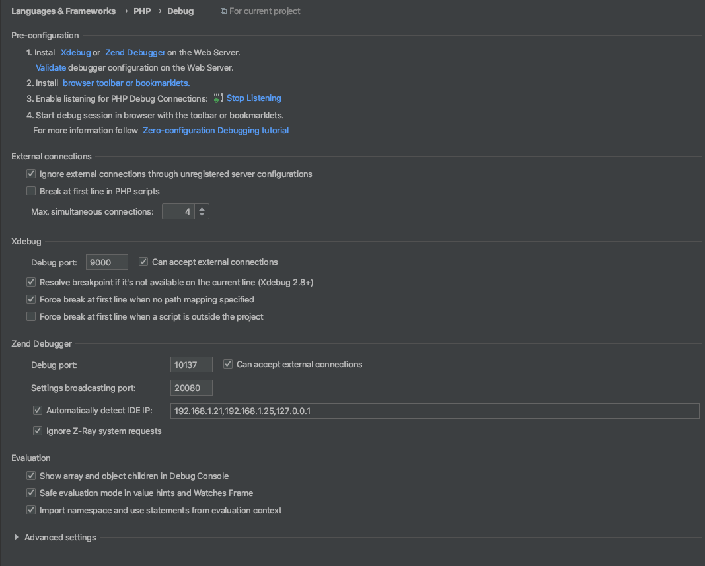
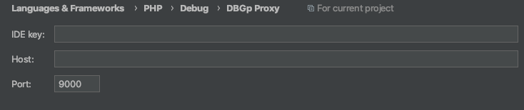

# Toggle xdebug

## Setup
```
pecl channel-update pecl.php.net ; pecl clear-cache
pecl install xdebug
```

pecl must have enabled xdebug to your php.ini. It should be removed. So check your /usr/local/etc/php/7.4/php.ini and remove the line 

```zend_extension="xdebug.so"```

Create the file /usr/local/etc/php/7.4/conf.d/ext-xdebug.ini
/usr/local/etc/php/7.4/conf.d/ext-xdebug.ini with the following

```
[xdebug]
zend_extension="xdebug.so"
xdebug.remote_autostart=1
xdebug.default_enable=1
xdebug.remote_port=9000
xdebug.remote_host=127.0.0.1
xdebug.remote_connect_back=1
xdebug.remote_enable=1
xdebug.idekey=PHPSTORM
```
## Install xdebug-toggler
```
curl -l https://raw.githubusercontent.com/lobotomised/xdebug-toggle/master/xdebug-toggle > /usr/local/bin/xdebug-toggle
chmod +x /usr/local/bin/xdebug-toggle
```

## Configure phpstorm



## Usage
```
xdebug on 
xdebug off
````